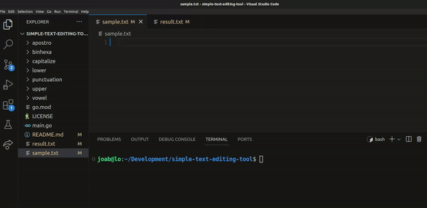

# simple-text-editing-tool

This is is a simple text completion/editing/auto-correction tool that receive as arguments the name of a file containing a text that needs some modifications (the input) and the name of the file the modified text should be placed in (the output)

## Description

- The tool is written in Go-lang

## Getting Started

### Prerequisites

- Some programming experience. The code here is pretty simple, but it helps to know something about functions.

- A tool to edit your code. Any text editor you have will work fine. Most text editors have good support for Go. The most popular are VSCode (free), GoLand (paid), and Vim (free).

- A command terminal. Go works well using any terminal on Linux and Mac, and on PowerShell or cmd in Windows.

### Setup

Install Go (if you haven't already).

- Link => https://go.dev/doc/tutorial/getting-started

Once go is setup and text editor installed
Open the editor

### Usage

- Add the contents to the sample.txt file
- Possible casses to add infront of text include:
- (cap), (up), (low), (hex), (bin)
- (cap, 2), (up, 3), (low, 2)

Example
In the sample.txt file add

```
Welcome to the Brooklyn bridge (cap)
```

In the terminal
run ->

```console
$ go run main.go sample.txt result.txt
```

In the result.txt file expected output is

```
Welcome to the Brooklyn Bridge
```



- More usage examples below

```

$ cat sample.txt
it (cap) was the best of times, it was the worst of times (up) , it was the age of wisdom, it was the age of foolishness (cap, 6) , it was the epoch of belief, it was the epoch of incredulity, it was the season of Light, it was the season of darkness, it was the spring of hope, IT WAS THE (low, 3) winter of despair.
$ go run . sample.txt result.txt
$ cat result.txt
It was the best of times, it was the worst of TIMES, it was the age of wisdom, It Was The Age Of Foolishness, it was the epoch of belief, it was the epoch of incredulity, it was the season of Light, it was the season of darkness, it was the spring of hope, it was the winter of despair.
$ cat sample.txt
Simply add 42 (hex) and 10 (bin) and you will see the result is 68.
$ go run . sample.txt result.txt
$ cat result.txt
Simply add 66 and 2 and you will see the result is 68.
$ cat sample.txt
There is no greater agony than bearing a untold story inside you.
$ go run . sample.txt result.txt
$ cat result.txt
There is no greater agony than bearing an untold story inside you.
$ cat sample.txt
Punctuation tests are ... kinda boring ,don't you think !?
$ go run . sample.txt result.txt
$ cat result.txt
Punctuation tests are... kinda boring, don't you think!?
```

## Technologies

- Go

## Help

Reach out via owalajoab@gmail.com

## Authors

This project was created by Joab Owala https://github.com/JoabOwala

## License

This project is licensed under the MIT License - see the LICENSE.md file for details

## Acknowledgments

- zone01 Kisumu

Happy Coding! 💪

###### @Mongoose 2024
